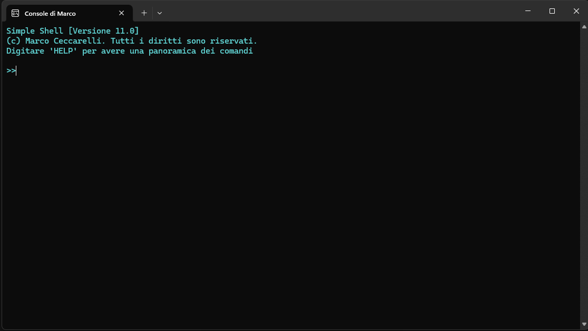
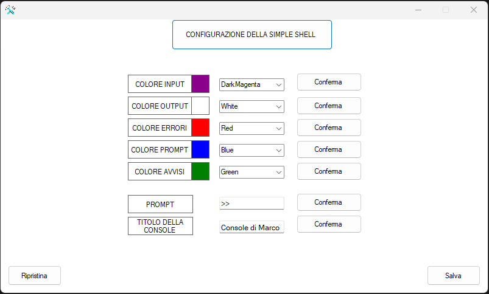

# Simple shell

My own command prompt written in c# as project during high school
<br>
Includes other school projects like COPY and PING and some personal extra feature
<br>
<br>
Executing it, windows defender could block the executable, don't worry that's completely normal
<br>
It's all in Italian because it is done for an Italian school. If you have any questions, you can contact me on LinkedIn or via email at 
<a href="malito:marco.ceccarelli.code@gmail.com
">marco.ceccarelli.code@gmail.com</a>
<br>

# Available commands

| Command  | DESCRIPTION |
| ------------- | ------------- |
|LIST (LS) [pattern]*|	Displays the contents of the current directory|
|CD	|Displays the current directory, filters by pattern if specified|
|CD [folder/path]	|Changes to the specified directory|
|CD ..	|Moves to the parent directory of the current one|
|DEL [pattern]	|Deletes all files in the current folder with the specified extension|
|TASKLIST [pattern]*|	Shows all running processes, filters by pattern if specified|
|TASKLIST -A	|Shows all running processes with a window|
|[EXECUTABLE]	|Executes the specified process|
|CLOSE [name]/[id]|	Sends a close command to the specified process|
|CLOSE [name]/[id] -F|	Forces termination of the process|
|COPY [source] to [destination]	|Copies the specified source folder into the specified destination folder|
|PING [attribute] destination	|Executes a ping with the specified parameters to the specified address|
|  [-n]|	Count
|  [-l]|	Size
|  [-i]|	ttl
|  [-w]|	timeout
|CONFIG (#CONFIG)	|Opens the settings form|
|HELP-MACRO|	Displays all available macros|
|ADDMACRO %[name]% [path]	|Sets a new macro with the specified path|
|TITLE [String]	|Changes the console title|

<hr style="border: none; height: 1px;">

<p align="center">
    
</p>

<!-- <hr style="border: none; height: 1px;"> -->
<br>

# Configuration

My favourite feature is configuration
<br>
It's my own external tool used to customize simple shell appearance
<br>
<br>
It saves the cufiguration parameters in 

```
C:\Users\user\AppData\Roaming\SimpleShell\Impostazioni.txt
```

To access this tool is enough to type 'CONFIG or #CONFIG' in the shell
<br>
You're also able to restore the default settings

<br>

<p align="center">
    
</p>